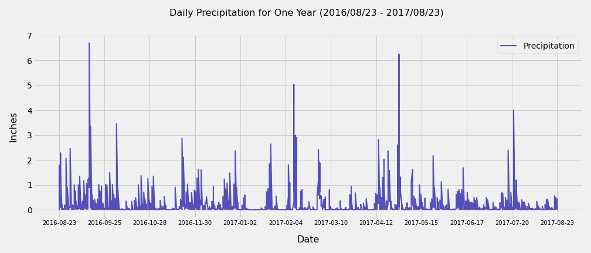
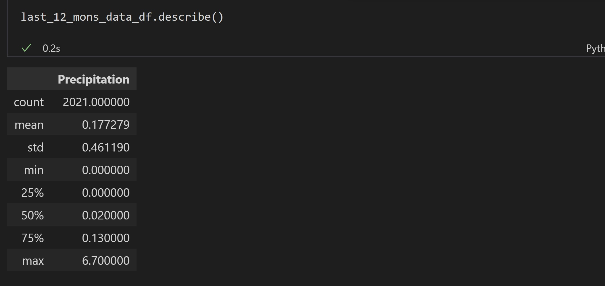

# sqlalchemy-challenge

## Project Description 
Climate analysis on Honolulu, Hawaii area. The following outlines the process.

## Step 1 - Climate Analysis and Exploration

Used Python and SQLAlchemy to do basic climate analysis and data exploration of climate database. All of the following analysis was completed by using SQLAlchemy ORM queries, Pandas, and Matplotlib.

* Used jupyter notebook to complete climate analysis and data exploration.

* Used SQLAlchemy `create_engine` to connect to sqlite database.

* Used SQLAlchemy `automap_base()` to reflect tables into classes and saved a reference to those classes called `Station` and `Measurement`.

* Linked Python to the database by creating an SQLAlchemy session.

* Closed out session at the end of the notebook.

### Precipitation Analysis

* Started by finding the most recent date in the data set.

* Retrieved the last 12 months of precipitation data by querying the 12 preceding months of data.

* Loaded the results into a Pandas DataFrame and set the index to the date column.

* Sort the DataFrame values by `date`.

* Plotted the results using the DataFrame `plot` method.

  

* Use Pandas to print the summary statistics for the precipitation data.
  
