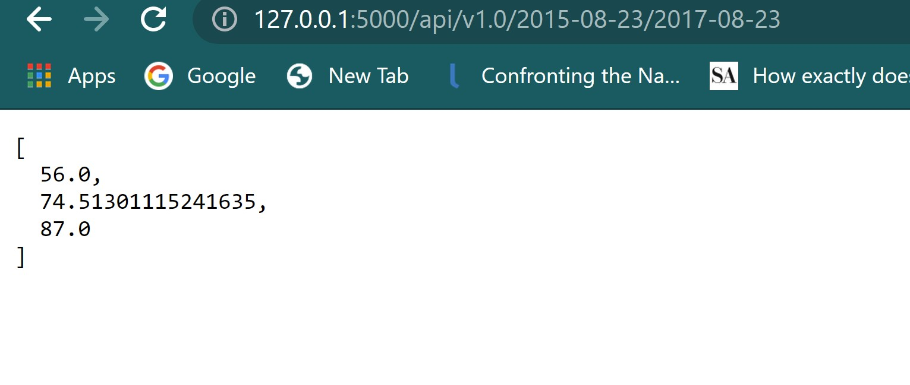
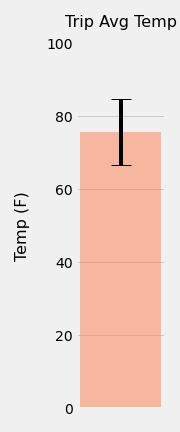
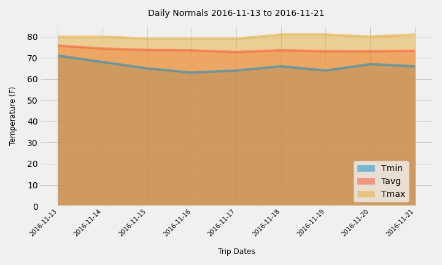

# Climate analysis using sqlalchemy

## Project Description 
Climate analysis on Honolulu, Hawaii area. The following outlines the process.

## Please download the repository to execute all the files successfully
* Jupyter notebook file [Honolulu_climate_analysis.ipynb](Honolulu_climate_analysis.ipynb) contains the analysis

## Step 1 - Climate Analysis and Exploration

Used Python and SQLAlchemy to do basic climate analysis and data exploration of climate database. All of the following analysis was completed by using SQLAlchemy ORM queries, Pandas, and Matplotlib.

* Used jupyter notebook to complete climate analysis and data exploration.

* Used SQLAlchemy `create_engine` to connect to sqlite database.

* Used SQLAlchemy `automap_base()` to reflect tables into classes and saved a reference to those classes called `Station` and `Measurement`.

* Linked Python to the database by creating an SQLAlchemy session.

### Precipitation Analysis

* Started by finding the most recent date in the data set.

* Retrieved the last 12 months of precipitation data by querying the 12 preceding months of data.

* Loaded the results into a Pandas DataFrame and set the index to the date column.

* Sorted the DataFrame values by `date`.

* Plotted the results using the DataFrame `plot` method.

  

* Used Pandas to print the summary statistics for the precipitation data.
  <table width="50%"><tr><td></td></tr></table>

### Station Analysis

* Designed a query to calculate the total number of stations in the dataset.

* Designed a query to find the most active stations (i.e. which stations have the most rows?).

  * List the stations and observation counts in descending order.
  <table width="50%"><tr><td></td></tr></table>

  * Using the most active station id, calculated the lowest, highest, and average temperature.
  <table width="30%"><tr><td></td></tr></table>
  

* Designed a query to retrieve the last 12 months of temperature observation data (TOBS).

  * Filtered by the station with the highest number of observations.
  <table width="20%"><tr><td></td></tr></table>

  * Queried the last 12 months of temperature observation data for this station.
  <table width="20%"><tr><td></td></tr></table>
  

  * Plotted the results as a histogram with `bins=12`.

    

## Step 2 - Climate App

After completing initial analysis, designed a Flask API based on the queries that have been developed.

* Used Flask to create routes.
* Developed app  [Flask API](app.py) that contains funtions to create and execute the flask app and display jasonified routes. 
<table width="80%"><tr><td></td></tr></table>

### Routes
* `/`

  * Home page.

  * List all routes that are available.
  <table width="50%"><tr><td></td></tr></table>

* `/api/v1.0/precipitation`

  * Converts the query results to a dictionary using `date` as the key and `prcp` as the value.

  * Returns the JSON representation of your dictionary.

  <table width="50%"><tr><td></td></tr></table> 

* `/api/v1.0/stations`

  * Returns a JSON list of stations from the dataset.

  <table width="50%"><tr><td></td></tr></table>     

* `/api/v1.0/tobs`
  * Queried the dates and temperature observations of the most active station for the last year of data.

  * Returns a JSON list of temperature observations (TOBS) for the previous year.
  <table width="50%"><tr><td></td></tr></table> 

* `/api/v1.0/<start>` and `/api/v1.0/<start>/<end>`

  * Returns a JSON list of the minimum temperature, the average temperature, and the max temperature for a given start or start-end range.

  * When given the start only, calculates `TMIN`, `TAVG`, and `TMAX` for all dates greater than and equal to the start date.
  <table width="50%"><tr><td></td></tr></table> 

  * When given the start and the end date, calculates the `TMIN`, `TAVG`, and `TMAX` for dates between the start and end date inclusive.  
  <table width="50%"><tr><td></td></tr></table> 

* Created 2 ADDITIONAL routes that will display the `TMIN`, `TAVG`, and `TMAX` for dates between the start and end date inclusive, for each INDIVIDUAL STATION.
  * When given the start only, calculates `TMIN`, `TAVG`, and `TMAX` for all dates greater than and equal to the start date.
  <table width="50%"><tr><td></td></tr></table> 

  * When given the start and the end date, calculates the `TMIN`, `TAVG`, and `TMAX` for dates between the start and end date inclusive.  
  <table width="50%"><tr><td></td></tr></table> 

### Temperature Analysis I

* Hawaii is reputed to enjoy mild weather all year. Is there a meaningful difference between the temperature in, for example, June and December?

* Identifid the average temperature for the months June and December at all stations across all available years in the dataset.
  <table width="20%"><tr><td></td></tr></table>
* Visualization 

  

  
  - *The scatter plot and histogram suggest that the month of June seems to have higher temperature compared to December.* 

* Used the t-test to determine whether the difference in the means, if any, is statistically significant.

  - *Used unpaired independent T-test with unequal variance, because sample sizes for the months of June and December are unequal.*
    <table width="20%"><tr><td></td></tr></table>
  - *There are 1700 samples for June and 1517 samples for December, and so cannot be paired in a before-after sense.*
  <table width="50%"><tr><td></td></tr></table> 
## Analysis
* The p-value in this case is 4.193529835915755e-187, which is far less than the standard thresholds of 0.05 or 0.01. 
* Based on the p-value, it can be concluded that there is a statistically significant difference between the June temperature and the December temperature.
* June has higher temperatures than December.  

### Temperature Analysis II

* To predict temperatures from August first to August seventh of last year. Using this historical data in the dataset to find out what the temperature has previously looked like.

* Used function called `calc_temps` that will accept a start date and end date in the format `%Y-%m-%d`. The function will return the minimum, average, and maximum temperatures for that range of dates.

* Used the `calc_temps` function to calculate the min, avg, and max temperatures for trip dates using the matching dates from a previous year (i.e., "2017-08-01"). Change these dates to analyze more dates to plan a trip.

* Plotted the min, avg, and max temperature as a bar chart.

  * Used "Trip Avg Temp" as the title.

  * Used the average temperature as the bar height (y value).

  * Used the peak-to-peak (TMAX-TMIN) value as the y error bar (YERR).

    

### Daily Rainfall Average

* Now that we have an idea of the temperature lets check to see what the rainfall has been for the same trip dates.

* Calculated the rainfall per weather station using the previous year's matching dates.

  * Sorted this in descending order by precipitation amount and list the station, name, latitude, longitude, and elevation.
  <table width="50%"><tr><td></td></tr></table> 

### Daily Temperature Normals

* Calculated the daily normals for the duration of your trip. 

* Used Pandas to plot an area plot (`stacked=False`) for the daily normals.

  

* Closed out session at the end.

