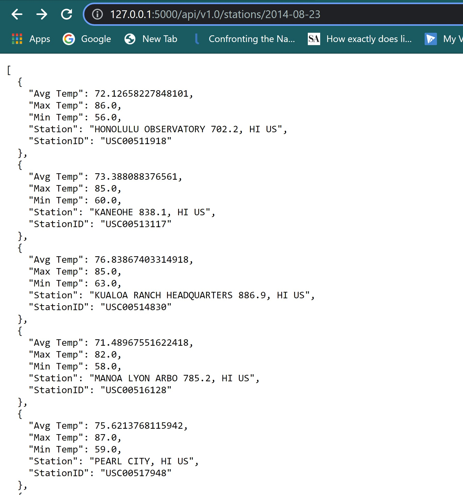
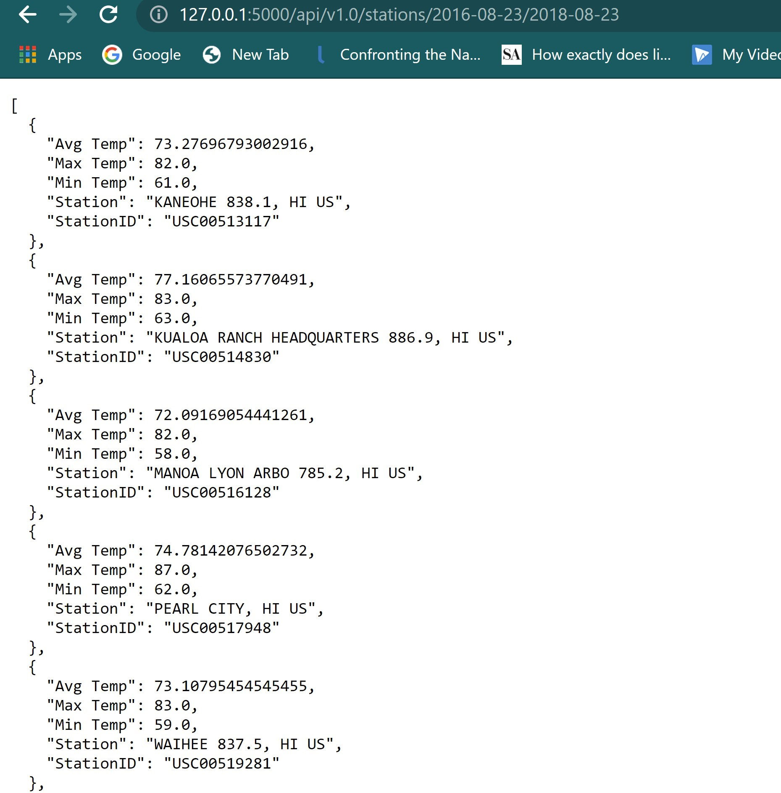

# sqlalchemy-challenge

## Project Description 
Climate analysis on Honolulu, Hawaii area. The following outlines the process.

## Step 1 - Climate Analysis and Exploration

Used Python and SQLAlchemy to do basic climate analysis and data exploration of climate database. All of the following analysis was completed by using SQLAlchemy ORM queries, Pandas, and Matplotlib.

* Used jupyter notebook to complete climate analysis and data exploration.

* Used SQLAlchemy `create_engine` to connect to sqlite database.

* Used SQLAlchemy `automap_base()` to reflect tables into classes and saved a reference to those classes called `Station` and `Measurement`.

* Linked Python to the database by creating an SQLAlchemy session.

### Precipitation Analysis

* Started by finding the most recent date in the data set.

* Retrieved the last 12 months of precipitation data by querying the 12 preceding months of data.

* Loaded the results into a Pandas DataFrame and set the index to the date column.

* Sort the DataFrame values by `date`.

* Plotted the results using the DataFrame `plot` method.

  

* Use Pandas to print the summary statistics for the precipitation data.
  <table width="50%"><tr><td></td></tr></table>

### Station Analysis

* Designed a query to calculate the total number of stations in the dataset.

* Designed a query to find the most active stations (i.e. which stations have the most rows?).

  * List the stations and observation counts in descending order.
  <table width="50%"><tr><td></td></tr></table>

  * Using the most active station id, calculated the lowest, highest, and average temperature.
  <table width="50%"><tr><td></td></tr></table>
  

* Designed a query to retrieve the last 12 months of temperature observation data (TOBS).

  * Filtered by the station with the highest number of observations.
  <table width="50%"><tr><td></td></tr></table>

  * Queried the last 12 months of temperature observation data for this station.
  <table width="30%"><tr><td></td></tr></table>
  

  * Plotted the results as a histogram with `bins=12`.

    

## Step 2 - Climate App

After completing initial analysis, designed a Flask API based on the queries that have been developed.

* Used Flask to create routes.
* Developed app  [Flask API](app.py) that contains funtions to create and execute the flask app and display jasonified routes. 
<table width="80%"><tr><td></td></tr></table>

### Routes
* `/`

  * Home page.

  * List all routes that are available.
  <table width="50%"><tr><td></td></tr></table>

* `/api/v1.0/precipitation`

  * Convert the query results to a dictionary using `date` as the key and `prcp` as the value.

  * Return the JSON representation of your dictionary.

  <table width="50%"><tr><td></td></tr></table> 

* `/api/v1.0/stations`

  * Return a JSON list of stations from the dataset.

  <table width="50%"><tr><td></td></tr></table>     

* `/api/v1.0/tobs`
  * Query the dates and temperature observations of the most active station for the last year of data.

  * Return a JSON list of temperature observations (TOBS) for the previous year.
  <table width="50%"><tr><td></td></tr></table> 

* `/api/v1.0/<start>` and `/api/v1.0/<start>/<end>`

  * Return a JSON list of the minimum temperature, the average temperature, and the max temperature for a given start or start-end range.

  * When given the start only, calculate `TMIN`, `TAVG`, and `TMAX` for all dates greater than and equal to the start date.
  <table width="50%"><tr><td></td></tr></table> 

  * When given the start and the end date, calculate the `TMIN`, `TAVG`, and `TMAX` for dates between the start and end date inclusive.  
  <table width="50%"><tr><td></td></tr></table> 

* Created 2 ADDITIONAL routes that will display the `TMIN`, `TAVG`, and `TMAX` for dates between the start and end date inclusive, for each INDIVIDUAL STATION.
  * When given the start only, calculates `TMIN`, `TAVG`, and `TMAX` for all dates greater than and equal to the start date.
  <table width="50%"><tr><td></td></tr></table> 

  * When given the start and the end date, calculates the `TMIN`, `TAVG`, and `TMAX` for dates between the start and end date inclusive.  
  <table width="50%"><tr><td></td></tr></table> 

